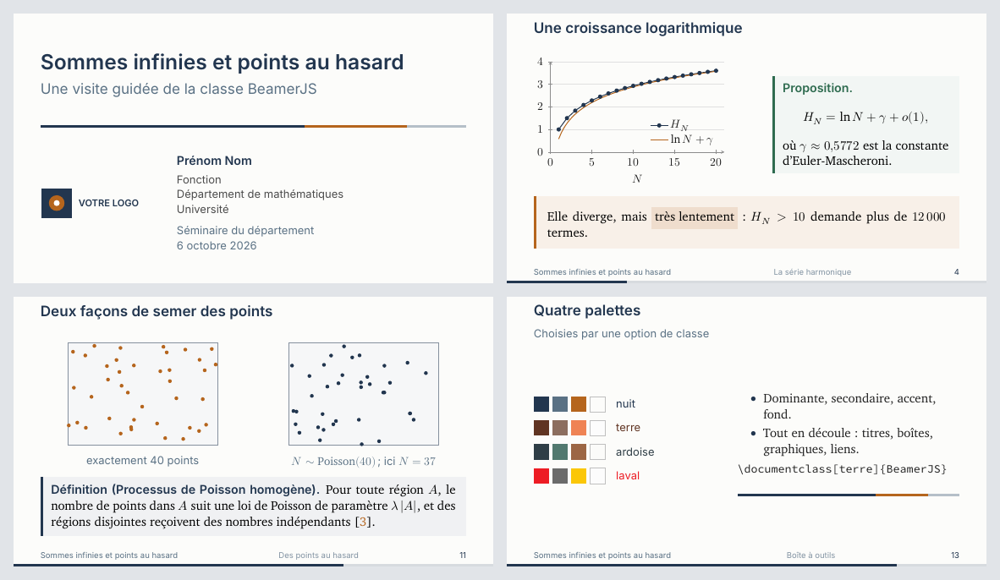

# BeamerJS — gabarit beamer pour les présentations mathématiques

*English version: [templateEN](../templateEN/README.md)*

BeamerJS est une classe LaTeX construite sur beamer, pensée pour les exposés
de mathématiques. Elle est sobre, lisible au projecteur et prête à l'emploi.



- **Format 16:9**, avec des titres en sans serif, du texte en serif et des
  mathématiques en Latin Modern Math.
- **Quatre palettes** et **cinq jeux de polices**, au choix par une option de classe.
- **Boîtes à filet latéral** pour les définitions, les théorèmes, les démonstrations et les remarques.
- **Barre de progression**, pied de page facultatif, diapos de section automatiques
  et annexe hors numérotation.
- **Nuages de points aléatoires** (uniformes ou de Poisson) dessinés en TikZ.
- **Tous les noms existent en français et en anglais** (`lemme` / `lemma`, `\defi` / `\term`…).

## Contenu du dossier

| Fichier | Rôle |
|---|---|
| `BeamerJS.cls` | la classe, commentée en français |
| `exemple-minimal.tex` | le point de départ d'une nouvelle présentation |
| `demonstration.tex` | une présentation qui utilise chacune des fonctionnalités |
| `references.bib` | la bibliographie de la démonstration |
| `images/` | logo fictif et aperçu |
| `latexmkrc` | indique à latexmk et à Overleaf de compiler avec XeLaTeX |
| `LICENSE` | texte officiel de la licence LPPL 1.3c |

## Compiler

### Sur votre ordinateur

Il faut une distribution TeX Live 2023 ou plus récente (ou MiKTeX à jour).
Toutes les polices utilisées font partie de TeX Live : vous n'avez rien à installer.

```sh
latexmk demonstration.tex
```

Le fichier `latexmkrc` choisit XeLaTeX et latexmk lance biber au besoin.
Sans latexmk, la séquence est `xelatex`, `biber`, `xelatex`, `xelatex`.
La classe compile aussi avec LuaLaTeX. Avec pdfLaTeX, elle fonctionne en
Latin Modern et ignore les options de police.

### Sur Overleaf

1. Compressez le dossier en `.zip`, puis faites **New Project → Upload Project**.
2. Dans **Menu**, réglez **Compiler** à **XeLaTeX** et **Main document** au fichier voulu
   (`exemple-minimal.tex` ou `demonstration.tex`).
3. Cliquez **Recompile**. Overleaf exécute biber automatiquement.

## Démarrer une présentation

```latex
\documentclass[nuit,charter]{BeamerJS}

\title{Titre de l'exposé}
\subtitle{Sous-titre}
\author{Prénom Nom}
\fonction{Professeure\\Département de mathématiques}
\institute{Université}
\evenement{Colloque des sciences mathématiques}
\date{\today}
\logotitre{images/mon-logo.pdf}

\begin{document}
\begin{frame}[plain,noframenumbering]
	\titlepage
\end{frame}

\section{Introduction}
\begin{frame}{Un premier résultat}{Sous-titre de diapo}
	\begin{thm}[Pythagore]
		$a^2+b^2=c^2$.
	\end{thm}
\end{frame}
\end{document}
```

## Options de classe

| Option | Effet |
|---|---|
| `fr` *(défaut)*, `en` | langue du document : césure, étiquettes des boîtes, bibliographie, nombres |
| `nuit` *(défaut)*, `terre`, `ardoise`, `laval` | palette de couleurs |
| `charter` *(défaut)*, `baskerville`, `newcm`, `source`, `libertinus` | jeu de polices de texte |
| `pied` | pied de page : titre court, section, numéro de diapo |
| `sansprogres` | retire la barre de progression |
| `sanssectionpage` | retire la diapo automatique au début de chaque section |

Toute autre option, `handout` par exemple, passe directement à beamer.

## Page titre

En plus de `\title`, `\subtitle`, `\author`, `\institute` et `\date` :

| Commande | Effet |
|---|---|
| `\fonction{...}` | titre professionnel sous le nom (`\\` pour changer de ligne) |
| `\evenement{...}` | congrès, séminaire, lieu |
| `\logotitre{fichier}` | logo à gauche ; sans cette commande, aucun logo |

Le titre court (`\title[court]{long}`) apparaît dans le pied de page.

## Environnements

Chaque boîte accepte un nom facultatif : `\begin{thm}[Euler] ... \end{thm}`.

| Français | Anglais | Usage |
|---|---|---|
| `defn` | `defn` | définition |
| `thm`, `prop`, `coro` | idem | théorème, proposition, corollaire |
| `lemme` | `lemma` | lemme |
| `preuve` | `proofbox` | démonstration |
| `ex`, `rem` | idem | exemple, remarque |
| `lumiere` | `idea` | une idée (pictogramme d'ampoule) |
| `notation` | `notation` | une convention de notation (pictogramme de crayon) |
| `boite{Titre}` | `framedbox{Titre}` | encadré à titre libre |
| `apoint` | `keypoint` | la phrase à retenir |

Les blocs beamer habituels (`block`, `alertblock`, `exampleblock`) suivent
aussi la palette.

Pour créer votre propre boîte :

```latex
\NouvelleBoiteJS{conj}{Conjecture}{Accent}{AccentBG}
% \NouvelleBoiteJS{nom}{Étiquette}{couleur du filet}{couleur du fond}
```

## Commandes

| Français | Anglais | Effet |
|---|---|---|
| `\defi{...}` | `\term{...}` | terme défini, en gras dans la couleur dominante |
| `\surligne{...}` | `\highlight{...}` | surlignage dans la couleur d'accent |
| `\attention{...}` | `\stress{...}` | gras dans la couleur d'accent |
| `\exergue{citation}{auteur}` | `\bigquote{...}{...}` | citation détachée |
| `\planpartiel[titre]` | `\partialtoc[titre]` | plan qui met la section courante en évidence |
| `\JSfilet[largeur]` | `\JSrule[largeur]` | filet tricolore de la page titre |
| `\apercupalette{nom}` | `\palettepreview{nom}` | aperçu d'une palette |
| `\debutannexe` … `\finannexe` | `\startappendix` … `\stopappendix` | diapos d'annexe |
| `\NouvelleBoiteJS` | `\NewBoxJS` | créer une boîte |

**Annexe.** Les diapos placées entre `\debutannexe` et `\finannexe` (juste avant
`\end{document}`) ne comptent pas dans le total. La barre de progression atteint
donc 100 % à la dernière diapo de l'exposé.

**Couleurs.** Vous pouvez utiliser `Dominante`, `Secondaire`, `Accent` et `Fond`
(ou `Primary`, `Secondary`, `Background`) partout : TikZ, `\color`, pgfplots.
Les graphiques pgfplots reprennent la palette automatiquement.

## Nuages de points

Ces commandes se placent dans un environnement `tikzpicture` :

```latex
\JSnuage{5}{3.4}{40}{7}             % 40 points uniformes, fenêtre 5 cm × 3,4 cm, graine 7
\JSnuagePoisson{5}{3.4}{2.35}{11}   % nombre de points ~ Poisson(2,35 × aire)
\JSdernierN                         % nombre de points du dernier nuage de Poisson
```

L'argument optionnel change le style des points : `\JSnuage[pointJS, fill=Dominante]{...}`.
Une même graine redonne le même nuage d'une compilation à l'autre.

## Bibliographie

La classe charge biblatex (style numérique, biber). Le fichier `references.bib`
est lu automatiquement s'il existe. Pour un autre fichier, utilisez
`\addbibresource{autre.bib}`. Citez avec `\cite{cle}` et affichez la liste
avec `\printbibliography` dans une diapo.

## Licence

© 2022–2026 Jérôme Soucy.

La classe `BeamerJS.cls` est distribuée sous la
[LaTeX Project Public License](https://www.latex-project.org/lppl/) (LPPL),
version 1.3c ou ultérieure. C'est la licence de LaTeX lui-même et de la
plupart des extensions de CTAN. Le texte officiel se trouve dans `LICENSE`.

En pratique :

- vous pouvez utiliser, copier et redistribuer la classe librement, y compris
  à des fins commerciales ;
- si vous redistribuez une version modifiée, donnez-lui un autre nom de
  fichier (par exemple `BeamerJS-moi.cls`) ou indiquez clairement qu'elle est
  modifiée, et conservez la mention de copyright ;
- les présentations faites avec la classe vous appartiennent : la licence
  ne leur impose rien.

Les fichiers d'exemple (`exemple-minimal.tex`, `demonstration.tex`) sont
libres de toute condition : copiez-les et modifiez-les comme bon vous semble.

Le logo de `images/` est fictif. Remplacez-le par le vôtre.
