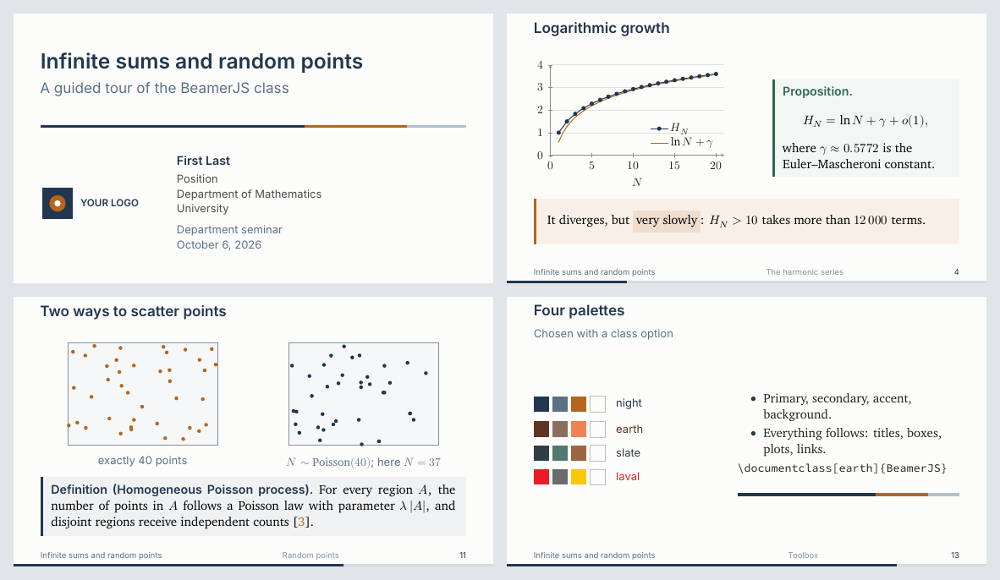

# BeamerJS — a beamer template for mathematics talks

*Version française : [gabaritFR](../gabaritFR/README.md)*

BeamerJS is a LaTeX class built on beamer for mathematics talks. It is clean,
easy to read on a projector and ready to use.



- **16:9 format**, with sans serif titles, serif text and mathematics in Latin Modern Math.
- **Four palettes** and **five font sets**, each chosen with a class option.
- **Side-rule boxes** for definitions, theorems, proofs and remarks.
- **Progress bar**, optional footer, automatic section frames and an appendix
  that is not counted in the frame total.
- **Random point clouds** (uniform or Poisson) drawn with TikZ.
- **Every name exists in English and French** (`lemma` / `lemme`, `\term` / `\defi`…).

## Folder contents

| File | Purpose |
|---|---|
| `BeamerJS.cls` | the class, commented in English |
| `minimal-example.tex` | the starting point for a new presentation |
| `demo.tex` | a presentation that uses every feature |
| `references.bib` | the demo bibliography |
| `images/` | placeholder logo and preview |
| `latexmkrc` | tells latexmk and Overleaf to compile with XeLaTeX |
| `LICENSE` | official text of the LPPL 1.3c license |

## Compiling

### On your computer

You need TeX Live 2023 or later (or an up-to-date MiKTeX). Every font the
class uses ships with TeX Live, so there is nothing else to install.

```sh
latexmk demo.tex
```

The `latexmkrc` file selects XeLaTeX, and latexmk runs biber when needed.
Without latexmk, the sequence is `xelatex`, `biber`, `xelatex`, `xelatex`.
The class also compiles with LuaLaTeX. With pdfLaTeX it falls back to Latin
Modern and ignores the font options.

### On Overleaf

1. Zip the folder, then use **New Project → Upload Project**.
2. In **Menu**, set **Compiler** to **XeLaTeX** and **Main document** to the file you want
   (`minimal-example.tex` or `demo.tex`).
3. Click **Recompile**. Overleaf runs biber automatically.

## Starting a presentation

```latex
\documentclass[night,charter]{BeamerJS}

\title{Title of the talk}
\subtitle{Subtitle}
\author{First Last}
\position{Professor\\Department of Mathematics}
\institute{University}
\event{Mathematical Sciences Colloquium}
\date{\today}
\titlelogo{images/my-logo.pdf}

\begin{document}
\begin{frame}[plain,noframenumbering]
	\titlepage
\end{frame}

\section{Introduction}
\begin{frame}{A first result}{Frame subtitle}
	\begin{thm}[Pythagoras]
		$a^2+b^2=c^2$.
	\end{thm}
\end{frame}
\end{document}
```

## Class options

| Option | Effect |
|---|---|
| `en` *(default)*, `fr` | document language: hyphenation, box labels, bibliography, numbers |
| `night` *(default)*, `earth`, `slate`, `laval` | colour palette |
| `charter` *(default)*, `baskerville`, `newcm`, `source`, `libertinus` | text font set |
| `footer` | footer: short title, section, frame number |
| `noprogress` | removes the progress bar |
| `nosectionpage` | removes the automatic frame at the start of each section |

Any other option, such as `handout`, is passed straight to beamer. The French
option names (`nuit`, `terre`, `ardoise`, `pied`, `sansprogres`,
`sanssectionpage`) also work.

## Title page

In addition to `\title`, `\subtitle`, `\author`, `\institute` and `\date`:

| Command | Effect |
|---|---|
| `\position{...}` | job title under the name (`\\` for a new line) |
| `\event{...}` | conference, seminar, place |
| `\titlelogo{file}` | logo on the left; without this command, no logo |

The short title (`\title[short]{long}`) appears in the footer.

## Environments

Each box takes an optional name: `\begin{thm}[Euler] ... \end{thm}`.

| English | French | Use |
|---|---|---|
| `defn` | `defn` | definition |
| `thm`, `prop`, `coro` | same | theorem, proposition, corollary |
| `lemma` | `lemme` | lemma |
| `proofbox` | `preuve` | proof |
| `ex`, `rem` | same | example, remark |
| `idea` | `lumiere` | an idea (light-bulb icon) |
| `notation` | `notation` | a notation convention (pencil icon) |
| `framedbox{Title}` | `boite{Title}` | framed box with a free title |
| `keypoint` | `apoint` | the take-away sentence |

The usual beamer blocks (`block`, `alertblock`, `exampleblock`) also follow
the palette. The `lemma` box replaces beamer's built-in `lemma` environment.

To create your own box:

```latex
\NewBoxJS{conj}{Conjecture}{Accent}{AccentBG}
% \NewBoxJS{name}{Label}{rule colour}{background colour}
```

## Commands

| English | French | Effect |
|---|---|---|
| `\term{...}` | `\defi{...}` | defined term, bold in the primary colour |
| `\highlight{...}` | `\surligne{...}` | highlight in the accent colour |
| `\stress{...}` | `\attention{...}` | bold in the accent colour |
| `\bigquote{quote}{author}` | `\exergue{...}{...}` | displayed quotation |
| `\partialtoc[title]` | `\planpartiel[title]` | outline with the current section highlighted |
| `\JSrule[width]` | `\JSfilet[width]` | three-colour rule from the title page |
| `\palettepreview{name}` | `\apercupalette{name}` | preview of a palette |
| `\startappendix` … `\stopappendix` | `\debutannexe` … `\finannexe` | appendix frames |
| `\NewBoxJS` | `\NouvelleBoiteJS` | create a box |

**Appendix.** Frames placed between `\startappendix` and `\stopappendix` (right
before `\end{document}`) are not counted in the frame total. The progress bar
therefore reaches 100 % on the last frame of the talk itself.

**Colours.** You can use `Primary`, `Secondary`, `Accent` and `Background`
(or `Dominante`, `Secondaire`, `Fond`) anywhere: TikZ, `\color`, pgfplots.
pgfplots plots pick up the palette automatically.

## Point clouds

These commands go inside a `tikzpicture` environment:

```latex
\JSscatter{5}{3.4}{40}{7}             % 40 uniform points, 5 cm × 3.4 cm window, seed 7
\JSpoissonScatter{5}{3.4}{2.35}{11}   % number of points ~ Poisson(2.35 × area)
\JSlastN                              % number of points in the last Poisson cloud
```

The optional argument changes the point style: `\JSscatter[pointJS, fill=Primary]{...}`.
The same seed gives the same cloud from one compilation to the next.

## Bibliography

The class loads biblatex (numeric style, biber). The file `references.bib` is
read automatically if it exists. For another file, use
`\addbibresource{other.bib}`. Cite with `\cite{key}` and print the list with
`\printbibliography` inside a frame.

## License

© 2022–2026 Jérôme Soucy.

The class `BeamerJS.cls` is released under the
[LaTeX Project Public License](https://www.latex-project.org/lppl/) (LPPL),
version 1.3c or later. This is the license of LaTeX itself and of most CTAN
packages. The full legal text is in `LICENSE`.

In practice:

- you may use, copy and redistribute the class freely, including for
  commercial purposes;
- if you redistribute a modified version, give it a different file name
  (for example `BeamerJS-mine.cls`) or clearly mark it as modified, and keep
  the copyright notice;
- presentations made with the class are yours: the license places no
  conditions on them.

The example files (`minimal-example.tex`, `demo.tex`) carry no conditions at
all: copy and modify them as you wish.

The logo in `images/` is a placeholder. Replace it with your own.
